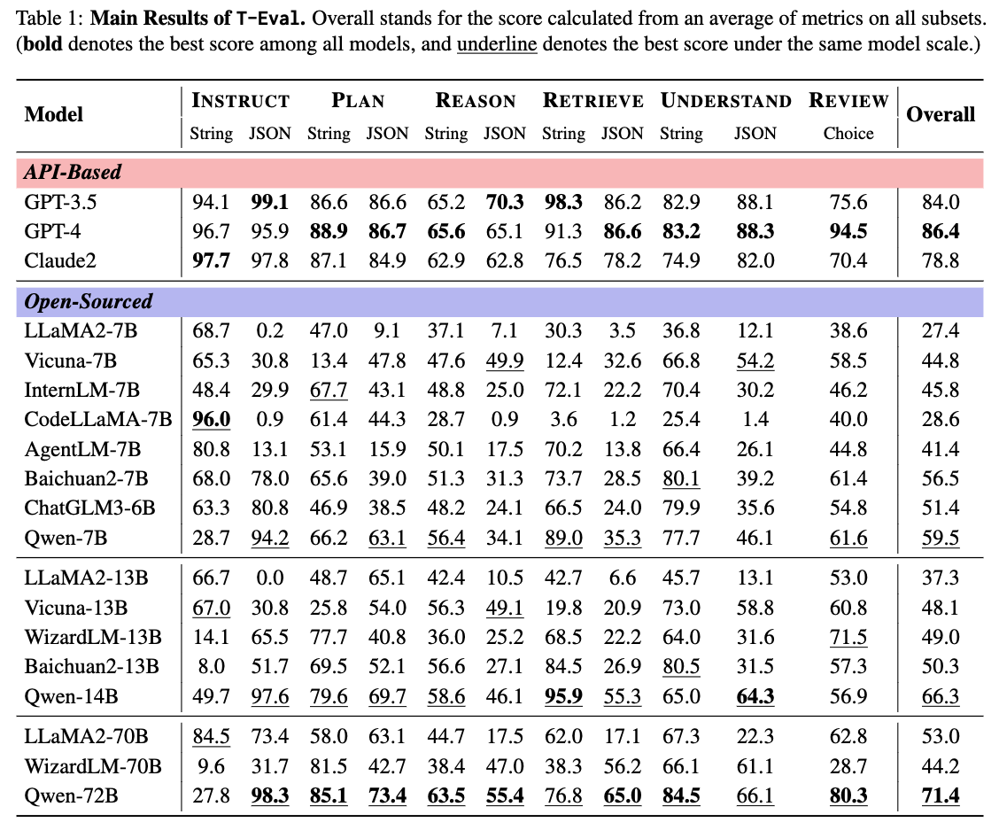

## Introduction
这项工作是在Teval的代码框架的基础上构建的金融benchmark. 和原版的Teval一样，我们评估模型在以下六个维度的能力: instruct, plan, reason, retrieve, understand 以及 review.
## 🛠️ Preparations

```bash
$ git clone https://github.com/Jz95585/T-Eval.git
$ cd T-Eval
$ pip install -r requirements.txt
$ cd lagent && pip install -e .
```

##  🛫️ Get Started

### 🤖 API Models

1. 设置OPENAI_API_KEY和OPENAI_API_BASE
```bash
export OPENAI_API_KEY=xxxxxxxxx
export OPENAI_API_BASE=xxxxxxxxx
```
2. 使用以下脚本运行评测(model_name 可以是OpenAI模型或者支持openai库调用的模型，例如deepseek-chat)
```bash
sh test.sh model_name
```

### 🤗 HuggingFace Models

1. 下载HuggingFace模型到你的本地路径.
2. 使用vllm部署你的模型
```bash
CUDA_VISIBLE_DEVICES=0,1 python -m vllm.entrypoints.openai.api_server \
    --model model_local_path \
    --tensor-parallel-size 2 \
    --gpu-memory-utilization 0.9 \
    --served-model-name model_name \
    --block-size 16  \
    --trust-remote-code \
    --port 8081
```
3. 使用以下脚本运行评测
```bash
export MKL_THREADING_LAYER=GNU \
export MKL_SERVICE_FORCE_INTEL=1 \
export OPENAI_API_KEY="EMPTY" \
export OPENAI_API_BASE=http://0.0.0.0:8081/v1

sh test.sh model_name
```

### 💫 Final Results
一旦你测试完了所有的数据，结果的细节会放在 `out_dirs/model_name/model_name_-1_zh.json`  通过以下命令计算最终分数:
```bash
python teval/utils/convert_results.py --result_path out_dirs/model_name/model_name_-1_zh.json
```

## 📊 Benchmark Results

<!-- More detailed and comprehensive benchmark results can refer to 🏆 [T-Eval official leaderboard](https://open-compass.github.io/T-Eval/leaderboard.html) ! -->

<!-- <div>
<center>

</div> -->

### ✉️ Submit Your Results

<!-- You can submit your inference results (via running test.py) to this [email](lovesnow@mail.ustc.edu.cn). We will run your predictions and update the results in our leaderboard. Please also provide the scale of your tested model. A sample structure of your submission should be like:
```
$model_display_name/
    instruct_$model_display_name/
        query_0_1_0.json
        query_0_1_1.json
        ...
    plan_json_$model_display_name/
    plan_str_$model_display_name/
    ...
``` -->

<!-- ## 💳 License

This project is released under the Apache 2.0 [license](./LICENSE). -->
